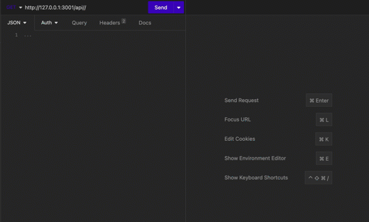

# Object-Relational Mapping (ORM) Challenge: E-commerce Back End

## Description
This application is the back-end for an e-commerce site. This application utilizes Express.js API and configure it to use Sequelize to interact with a MySQL database.

## Table of Contents
- [Installation](#installation)
- [Usage](#usage)
- [Credits](#credits)
- [Features](#features)
- [Examples](#examples)

## Installation
1. Clone the repo
2. Open the repo in your IDE and open the terminal.
3. Open the Develop file in your integrated terminal
4. Create an .env file in the Develop folder with the following information:
```
DB_NAME='ecommerce_db'
DB_USER=`your root username``
DB_PW=`your root password``
```
4. Type into your terminal ```mysql -u root```
5. After, ```SOURCE db/schema.sql``` and ```quit``` to close the MySQL terminal
6. Type into your terminal ```npm i```
7. Type into your terminal ```node seeds/index.js```
8. Lastly, type into your terminal ```npm start```
9. Open Insomnia and use the routes in the appication. 

## Usage
Internet retail, also known as e-commerce, plays a significant role within the electronics industry, as it empowers businesses and consumers alike to conveniently engage in online buying and selling of electronic products. In the latest available data from 2021, the industry in the United States alone was estimated to have generated the substantial amount of US$2.54 trillion, according to the United Nations Conference on Trade and Development. E-commerce platforms like Shopify and WooCommerce provide a suite of services to businesses of all sizes. Due to the prevalence of these platforms, developers should understand the fundamental architecture of e-commerce sites.

## Credits
This application was cloned from https://github.com/coding-boot-camp/fantastic-umbrella for the UofO Module 13 challenge.

## Features
Express.js API, Sequelize, MySQL

## Example
[Video Walkthrough can be found here](https://drive.google.com/file/d/1DeOIiqsHtvhvL0voJDdUZ8b04vBecFxz/view?usp=share_link)

